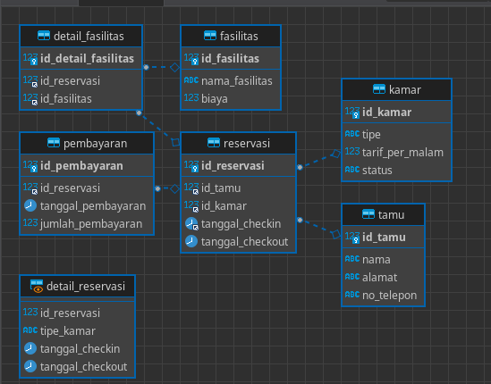

# DBA Perhotelan
Kelas 21IF05

Anggota Kelompok:

|NIM|Nama|
|---|---|
|21.11.4001|Safitri|
|21.11.4002|Binsar Dwi Jasuma|
|21.11.4003|Iska Rahmawati|
|21.11.4028|Aisyah Shafira|


# ERD


# Database Security
Step by step menambahkan role dan usernya
```sql
-- membuat role
CREATE ROLE 'role_pegawai';


-- pegawai tidak bisa menghapus data
GRANT SELECT, INSERT, UPDATE ON perhotelan.reservasi TO 'role_pegawai';
GRANT SELECT, INSERT, UPDATE ON perhotelan.kamar TO 'role_pegawai';


-- Membuat user pegawai hotel
CREATE USER 'pegawai_hotel'@'localhost' IDENTIFIED BY 'pegawai_hotel';


-- memberikan role ke user pegawai hotel
GRANT 'role_pegawai' TO 'pegawai_hotel'@'localhost';


-- NOTE: Dalam beberapa kasus mysql tidak memberikan akses database langusng ke user maka perlu menjalankan ini untuk mentrigger mysql supaya memberikan aksesnya
GRANT SELECT, INSERT, UPDATE ON perhotelan.* TO 'pegawai_hotel'@'localhost';
```


NOTE: Sesuai nama databasenya